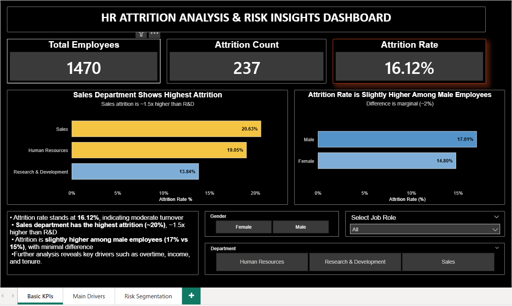
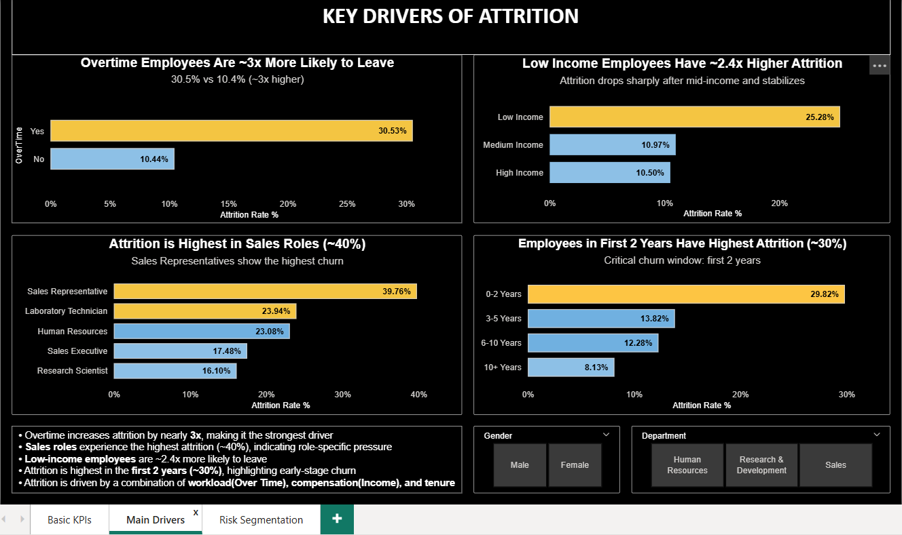
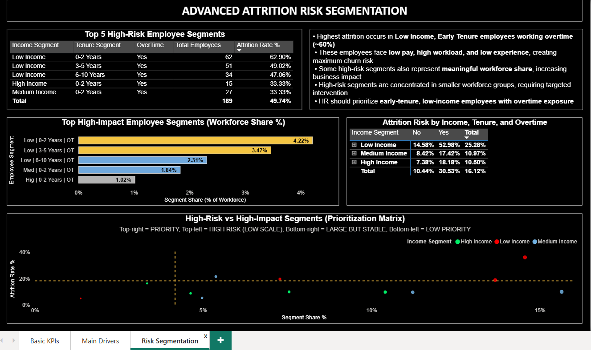

# 📊 **HR Attrition Prediction & Risk Segmentation** 

## 🚀 Overview
Employee attrition is a critical business challenge impacting **cost, productivity, and workforce stability**.

This project delivers an **end-to-end analytics solution** to:
- Predict employee attrition  
- Identify key drivers of churn  
- Translate insights into actionable retention strategies  

---

## 🎯 Objectives
- Identify employees at high risk of leaving  
- Understand key factors driving attrition  
- Enable proactive, data-driven HR decision-making  

---

## 📦 Dataset
- Source: **IBM HR Analytics Dataset**  
- Records: **1470 employees**  
- Features: **23 variables** (demographics, job role, satisfaction, compensation, etc.)  
- Target: **Attrition (0 = No, 1 = Yes)**  
- Note: Imbalanced dataset (~16% attrition rate)

---

## ⚙️ Approach

### 🔹 Data Preparation
- Data validation (missing values, duplicates, data types)  
- Feature engineering:
  - Tenure groups  
  - Income segments  
  - High-risk flag  

### 🔹 Modeling
- Logistic Regression (baseline + optimized)  
- Random Forest  
- XGBoost  

### 🔹 Model Optimization
- Class imbalance handling  
- **Threshold tuning (recall-focused)**  
- ROC-AUC evaluation  

### 🔹 Explainability
- SHAP (feature importance and model interpretation)  

### 🔹 Business Output
- Risk segmentation:
  - Low Risk  
  - Medium Risk  
  - High Risk  

---

## 📊 Dashboard Preview

### 🔹 Overview KPIs


### 🔹 Key Drivers


### 🔹 Risk Segmentation


---

## 🧠 Key Insights
- **Attrition Rate:** ~16% (moderate turnover)  
- Overtime employees are **~3x more likely to leave**  
- Low-income employees show **~2.4x higher attrition**  
- Highest churn occurs in the **first 2 years (~30%)**  
- Sales roles exhibit the **highest attrition (~40%)**  

---

## 🏆 Model Performance

| Model               | ROC-AUC | Key Strength                     |
|--------------------|--------|----------------------------------|
| Logistic Regression | **~0.83–0.84** | Best balance + interpretability |
| Random Forest       | ~0.78  | Captures non-linearity           |
| XGBoost             | ~0.78  | Robust but not superior          |

---

## ⚠️ Threshold Optimization
- Default threshold (0.5) under-detects attrition  
- Optimized threshold (~0.30–0.49) significantly improves **recall**  
- Enables better identification of at-risk employees  

---

## ✅ Final Model Selection

**Selected Model: Logistic Regression**

### Why Logistic Regression?
- Achieved the **highest ROC-AUC (~0.83–0.84)**  
- Delivered **best recall (~87%) after threshold tuning**  
- More **interpretable and stable** than tree-based models  

### Key Insight
Despite testing advanced models, Logistic Regression performed best, indicating:

> **The dataset exhibits strong linear relationships where simpler models outperform complex ones.**

---

### 🎯 Business Justification
- Priority: **minimize missed attrition cases (high recall)**  
- Provides strong performance with **clear interpretability**  
- Suitable for **real-world HR decision-making and deployment**  

👉 Final model is optimized for **decision support, not just prediction accuracy**

---

## 🔍 Key Drivers of Attrition
- OverTime  
- Monthly Income  
- Tenure (YearsAtCompany)  
- Job Satisfaction  
- Environment Satisfaction  
- Distance from Home  

---

## 💼 Business Impact

### 🎯 Risk Segmentation
- **High Risk (~8–10%)** → Immediate intervention  
- **Medium Risk (~15–20%)** → Monitor & engage  
- **Low Risk (~70%+)** → Stable workforce  

---

### 📌 Recommended Actions
1. Reduce overtime workload 
2. Optimize compensation and benefits
3. Strengthen early tenure engagement (0–2 years)  
4. Target high-risk roles (e.g., Sales)
5. Deploy early warning system (>30% attrition risk)

---

## 🛠️ Tech Stack
- **Excel:** Data preprocessing  
- **Python:** pandas, numpy, scikit-learn  
- **Modeling:** Logistic Regression, Random Forest, XGBoost  
- **Visualization:** matplotlib, seaborn  
- **Explainability:** SHAP  
- **BI Tool:** Power BI  
- **SQL:** Data exploration  

---

## ⚙️ Setup
```bash
pip install -r requirements.txt
```

---

## 📁 Project Structure

hr-attrition-analysis/
│
├── data/
├── notebook/
├── sql/
├── dashboard/
├── images/
└── README.md

---

## 🚀 Key Takeaway

Attrition is driven by workload, compensation, and early tenure — and can be proactively managed using data-driven insights.

The model is a decision-support tool to improve retention and workforce planning.

---

## 👤 Author

Rahul
Data Analyst | Business-Focused Analytics
